# RAKBANK Data Platform — Data Project Lifecycle: Comprehensive Delivery Guide

> **Purpose of this document:** This guide is the single executable reference for every data project
> delivered on the RAKBANK Data Platform. It expands the sequencing backbone in
> [09-project-lifecycle.md](09-project-lifecycle.md) into step-by-step actions, visual flow,
> gate-by-gate checklists, and role-specific accountabilities. Any team member — from a new Data
> Engineer to a Business Owner signing off UAT — should be able to open this document and know exactly
> what to do, in what order, and who else must be involved.
>
> **Stack:** Databricks on Azure · Medallion Architecture · Informatica IDGC · Unity Catalog · Erwin · GitHub Actions

---

## Contents

1. [How to Use This Guide](#1-how-to-use-this-guide)
2. [Visual Overview — End-to-End Flow](#2-visual-overview--end-to-end-flow)
3. [Phase and Stage Reference](#3-phase-and-stage-reference)
4. [Pre-Engineering Phase (Stages 0–3)](#4-pre-engineering-phase-stages-03)
   - [Stage 0 — Data Product Definition](#stage-0--data-product-definition)
   - [Stage 1 — Data Mapping](#stage-1--data-mapping)
   - [Stage 2 — Source Feasibility Review (Automated)](#stage-2--source-feasibility-review-automated)
   - [Stage 3 — Data & Physical Design](#stage-3--data--physical-design)
5. [Engineering Build Phase (Stage 4)](#5-engineering-build-phase-stage-4)
   - [Stage 4a — New Entity Onboarding](#stage-4a--new-entity-onboarding)
   - [Stage 4b — Silver Pipeline Build](#stage-4b--silver-pipeline-build)
   - [Stage 4c — Gold Pipeline Build](#stage-4c--gold-pipeline-build)
   - [G0 — Dev Complete Gate](#g0--dev-complete-gate)
6. [Validation Phase (Stages 5–6)](#6-validation-phase-stages-56)
   - [Stage 5 — Data Quality & Reconciliation Validation](#stage-5--data-quality--reconciliation-validation)
   - [Stage 6 — Logical Mart Review (Data Acceptance)](#stage-6--logical-mart-review-data-acceptance)
7. [Consumption & Go-Live Phase (Stages 7–10)](#7-consumption--go-live-phase-stages-710)
   - [Stage 7 — Semantic / Report Build](#stage-7--semantic--report-build)
   - [Stage 8 — UAT + Performance Testing (Parallel)](#stage-8--uat--performance-testing-parallel)
   - [Stage 9 — Production Readiness](#stage-9--production-readiness)
   - [Stage 10 — Go-Live & Hypercare](#stage-10--go-live--hypercare)
8. [Gate Summary Reference](#8-gate-summary-reference)
9. [Roles, Responsibilities & RACI](#9-roles-responsibilities--raci)
10. [Tooling Reference](#10-tooling-reference)
11. [Hard Rules & Common Pitfalls](#11-hard-rules--common-pitfalls)

---

## 1. How to Use This Guide

- **Project Kick-off:** Start at Stage 0. Do not skip stages or gates.
- **Returning mid-project:** Find your current stage, check what exit criteria remain open in Jira, then follow the steps in this document.
- **Gate reviewers:** Jump to the [Gate Summary Reference](#8-gate-summary-reference) for the checklist you are asked to approve.
- **Business stakeholders:** Refer to Stage 0 (Brief sign-off), Stage 6 (Data Acceptance), Stage 8 (UAT), and Stage 10 (Hypercare sign-off).
- **Gate outcome states:** Every gate resolves as **PASS** (proceed to next stage), **CONDITIONAL PASS** (proceed with formally logged risks), or **FAIL** (return to the relevant stage to remediate before re-raising the gate).

---

## 2. Visual Overview — End-to-End Flow

The following diagram shows all stages, automated CI/CD gates, governance quality gates, and decision points in their correct sequence.

```mermaid
flowchart TD
    START(["📋 Business Idea /\nRegulatory Requirement\n(Jira Epic created)"])

    %% ─── PRE-ENGINEERING PHASE ───────────────────────────────────────────
    subgraph PRE["🔵 PRE-ENGINEERING PHASE — No code written yet"]
        direction TB
        S0["Stage 0\n━━━━━━━━━━━━━━━━\n📌 Data Product Definition\nOwner: Data Owner\n─────────────────\n• Draft Data Product Brief\n• Define SLAs/OLAs\n• Register in Informatica IDGC\n• Author initial DQ rules"]
        GS0{{"CI Gate\n─────────\nIDGC entry exists?\nDQ rules authored?\nData Steward approved PR?"}}
        S1["Stage 1\n━━━━━━━━━━━━━━━━\n📐 Data Mapping\nOwner: Data Steward + Data Analyst\n─────────────────\n• Author source→target mapping YAML\n• Commit to /mappings/<domain>/\n• Raise Mapping PR"]
        S2["Stage 2 (Automated)\n━━━━━━━━━━━━━━━━\n🤖 Source Feasibility Report\nGenerated by Stage 1 CI pipeline\n─────────────────\n• Table inventory, row counts\n• Schema snapshots\n• Known constraints auto-detected"]
        GS1{{"CI Gate\n─────────\nChange-impact report generated?\nFeasibility report generated?\nAll columns mapped?\nData Architect approved PR?"}}
        S3["Stage 3\n━━━━━━━━━━━━━━━━\n🏗️ Data & Physical Design\nOwner: Data Architect\n─────────────────\n• Author Erwin model (logical + physical)\n• DDL auto-generated by pipeline\n• DQ rules authored for ALL layers\n  (Bronze, Silver, Gold)\n• Raise Model PR"]
        GS3{{"CI Gate\n─────────\nErwin version tag recorded?\nDDL auto-generated (no manual DDL)?\nSchema standards checklist passed?\nDQ rules present for all layers?\nData Architect approved PR?"}}
        GS3_CD[["▶ CD Pipeline\nCreates / alters physical\ntables in Databricks"]]
    end

    %% ─── ENGINEERING BUILD PHASE ─────────────────────────────────────────
    subgraph ENG["🟡 ENGINEERING BUILD PHASE — Stage 4"]
        direction TB
        S4a["Stage 4a\n━━━━━━━━━━━━━━━━\n📥 New Entity Onboarding\nOwner: Data Engineer\n─────────────────\n• Run data profiling in IDGC\n• Confirm PK / BK\n• Implement landing + bronze ingest\n• Raise Integration PR"]
        GS4a{{"CI Gate → G1 Bronze Gate\n─────────────────────────\nProfiling in IDGC?\nBronze DQ rules confirmed?\nPK/BK declared in DDL + mapping?\nDDL matches Stage 3 model?\nUnit tests passing?\nData Engineer + Steward approved?"}}
        GS4a_CD[["▶ CD Pipeline\nDeploys ingestion jobs\nAuto-provisions standard\nbronze DQ checks"]]
        S4b["Stage 4b\n━━━━━━━━━━━━━━━━\n🥈 Silver Pipeline Build\nOwner: Data Engineer\n─────────────────\n• Implement bronze→silver transform\n• Feature branch:\n  feature/<ticket>-<desc>\n• Raise Feature Branch PR"]
        GS4b{{"CI Gate\n─────────\nSilver DQ rules in IDGC?\nUnit tests passing?\nNaming conventions met?\nTransformations trace to mapping?\nData Engineer peer approved?"}}
        GS4b_CD[["▶ CD Pipeline\nDeploys silver pipeline"]]
        S4c["Stage 4c\n━━━━━━━━━━━━━━━━\n🥇 Gold Pipeline Build\nOwner: Data Engineer\n─────────────────\n• Implement silver→gold transform\n• Feature branch PR\n  (same process as 4b)"]
        GS4c{{"CI Gate\n─────────\nGold DQ rules in IDGC?\nUnit tests passing?\nData Engineer + Analyst approved?"}}
        GS4c_CD[["▶ CD Pipeline\nDeploys gold pipeline"]]
        G0{{"🔴 G0 — Dev Complete Gate\n─────────────────────────────\nAll pipelines run end-to-end in Dev?\nNo ad-hoc schema changes?\nAll CI checks green?\nTech Lead approved?"}}
    end

    %% ─── VALIDATION PHASE ────────────────────────────────────────────────
    subgraph VAL["🟠 VALIDATION PHASE — Stages 5–6"]
        direction TB
        S5["Stage 5\n━━━━━━━━━━━━━━━━\n🔍 DQ Validation\nOwner: Data Steward\n─────────────────\n• Run DQ rules in Informatica\n• Run recon against source systems\n• Review DQ scorecard\n• Log exceptions with owners"]
        G2{{"🔴 G2 — Silver Gate\n─────────────────────────────\nDQ score ≥ 90?\nRecon within tolerances?\nPK uniqueness + FK integrity pass?\nAll G2 artefacts complete?"}}
        S6["Stage 6\n━━━━━━━━━━━━━━━━\n📊 Logical Mart Review\nOwner: Data Owner\n─────────────────\n• Business reviews gold datasets\n• KPIs validated against decisions\n• Lineage attested in Informatica\n• Exception register finalised"]
        G3{{"🔴 G3 — Gold Gate\n─────────────────────────────\nBusiness Owner signed off?\nEach KPI maps to a decision?\nLineage verified end-to-end?\nData defensible to Audit/Risk?\nAll G3 artefacts complete?"}}
    end

    %% ─── CONSUMPTION & GO-LIVE PHASE ────────────────────────────────────
    subgraph CON["🟢 CONSUMPTION & GO-LIVE PHASE — Stages 7–10"]
        direction TB
        S7["Stage 7\n━━━━━━━━━━━━━━━━\n📈 Semantic / Report Build\nOwner: Data Engineer\n─────────────────\n• Build Power BI semantic model\n• Define RLS by business persona\n• Validate semantic parity with Gold\n• Register all consuming assets"]
        S8_UAT["Stage 8 — UAT\n━━━━━━━━━━━━━━━━\n✅ Usage Validation\nOwner: Business Owner\n─────────────────\n• Scenario-based business testing\n• Negative / boundary tests\n• Pre-go-live recon re-run\n• Defect log with severity"]
        S8_PT["Stage 8 — PT\n━━━━━━━━━━━━━━━━\n⚡ Performance Testing\nOwner: Data Engineer\n─────────────────\n• Runs PARALLEL to UAT\n• Concurrency & volume benchmarks\n• Pipeline SLA validation\n• Databricks Query History evidence"]
        G4{{"🔴 G4 — Semantic Gate\n─────────────────────────────\nSemantic parity check passed?\nRLS tested (positive + negative)?\nUAT: all Critical/High defects resolved?\nBusiness Owner signed off?\nPT benchmarks met?\nProd access policies verified?\nOps runbook published?\nAll G4 artefacts complete?"}}
        S9["Stage 9\n━━━━━━━━━━━━━━━━\n🛡️ Production Readiness\nOwner: Platform Lead\n─────────────────\n• Configure monitoring & alerting\n• Publish ops runbook to Git\n• Verify Unity Catalog access grants\n• Confirm on-call ownership"]
        S10["Stage 10\n━━━━━━━━━━━━━━━━\n🚀 Go-Live & Hypercare\nOwner: Data Engineer\n─────────────────\n• Deploy to production\n• Heightened support window\n• Daily alert/incident summary log\n• Post-go-live report"]
    end

    BAU(["✅ BAU Operations\nData product in production\nHandoff to support team"])

    %% ─── TRANSITIONS ─────────────────────────────────────────────────────
    START --> S0
    S0 --> GS0
    GS0 -- "❌ FAIL\nRemediate in IDGC" --> S0
    GS0 -- "✅ PASS\nPR merged" --> S1

    S1 --> S2
    S2 --> GS1
    GS1 -- "❌ FAIL\nRemediate mapping" --> S1
    GS1 -- "✅ PASS\nMapping PR merged" --> S3

    S3 --> GS3
    GS3 -- "❌ FAIL\nRemediate model/DDL/DQ rules" --> S3
    GS3 -- "✅ PASS\nModel PR merged" --> GS3_CD
    GS3_CD --> S4a

    S4a --> GS4a
    GS4a -- "❌ FAIL" --> S4a
    GS4a -- "✅ PASS\nIntegration PR merged" --> GS4a_CD
    GS4a_CD --> S4b

    S4b --> GS4b
    GS4b -- "❌ FAIL" --> S4b
    GS4b -- "✅ PASS\nPR merged" --> GS4b_CD
    GS4b_CD --> S4c

    S4c --> GS4c
    GS4c -- "❌ FAIL" --> S4c
    GS4c -- "✅ PASS\nPR merged" --> GS4c_CD
    GS4c_CD --> G0

    G0 -- "❌ FAIL\nReturn to remediation" --> ENG
    G0 -- "✅ PASS" --> S5

    S5 --> G2
    G2 -- "❌ FAIL\nReturn to engineering" --> ENG
    G2 -- "✅ PASS" --> S6

    S6 --> G3
    G3 -- "❌ FAIL\nReturn to engineering" --> ENG
    G3 -- "✅ PASS" --> S7

    S7 --> S8_UAT
    S7 --> S8_PT
    S8_UAT --> G4
    S8_PT --> G4

    S9 --> G4
    G4 -- "✅ PASS" --> S10
    G4 -- "❌ FAIL\nFix defects (UAT/PT/Monitoring)\nthen repeat S9 checks" --> S9
    S10 --> BAU
```



---

## 3. Phase and Stage Reference

| Phase | Stages | Focus | Code? | Key Gate |
|-------|--------|-------|-------|----------|
| **Pre-Engineering** | 0 → 3 | Define, map, design — before any pipeline code | ❌ No pipeline code | Model PR (CD deploys DDL) |
| **Engineering Build** | 4a → 4c | Build ingestion and transform pipelines | ✅ Yes | G0 Dev Complete |
| **Validation** | 5 → 6 | Prove data correctness; business acceptance | ❌ Remediation only | G2 Silver · G3 Gold |
| **Consumption & Go-Live** | 7 → 10 | Build BI layer; UAT; PT; prod deploy | ✅ Limited (BI only) | G4 Semantic |

> **Note on gate numbering:** The governance quality gates are numbered G0–G4. Counterintuitively, G1
> (Bronze Gate — integration PR for ingest) is triggered *inside* Stage 4a, which is *before* G0
> (Dev Complete — all Stage 4 pipelines finished). G0 is the "opening gate" signalling all dev work
> is done; G1 confirms the bronze layer specifically is deployed correctly. Both are required before
> Stage 5 can begin.

---

## 4. Pre-Engineering Phase (Stages 0–3)

> **Hard rule:** No pipeline code may be written, no DDL executed, and no feature branch opened
> until the Stage 3 Model PR has been merged and the CD pipeline has created physical tables in
> Databricks.

---

### Stage 0 — Data Product Definition

**Purpose:** Establish *why* this data product exists and *what* it must deliver, before a single line of
code is considered. Register the product in Informatica IDGC so the catalog is the source of truth from
day one. Obtain the named stakeholders who will be accountable throughout delivery.

**Primary Owner:** Data Owner  
**Required sign-offs:** Business Owner, Data Governance Officer

#### Executable Steps

| # | Step | Who | Tool / Location |
|---|------|-----|-----------------|
| 1 | Create a Jira epic for the data product. Record the business requirement or regulatory mandate that is driving this work. | Data Owner | Jira |
| 2 | Draft the **Data Product Brief**: decisions supported; primary KPIs (even if not fully specified); named consumers (individuals and teams); refresh SLA; data freshness SLA; real-time feed record-count variance thresholds (if applicable); named Data Owner. | Data Owner + Data Analyst | Jira / Confluence |
| 3 | Produce the **source systems list**: enumerate all source applications, databases, or feeds that will contribute data. | Data Analyst | Jira / mapping doc |
| 4 | Define the **SLA / OLA agreement** with each consuming team: load SLA, query response SLA, freshness SLA. Obtain written acknowledgement from consuming team leads. | Data Owner | Email / Jira comment |
| 5 | Register the **data product in Informatica IDGC**: complete all mandatory attributes as defined in [01-data-standards.md § 1.2](01-data-standards.md). Set status to *Draft*. | Data Steward | Informatica IDGC |
| 6 | Author the **initial DQ rule set** in Informatica IDGC. At minimum, the standard checks must be present: record count reconciliation, business key uniqueness, mandatory-column null rate, arrival SLA. These are defined in [04-release-gates.md § 4.6.1](04-release-gates.md). | Data Steward | Informatica IDGC |
| 7 | Write a brief **Quality & Reconciliation Approach** statement: how will data be validated at each layer transition? What tolerance thresholds are expected? | Data Steward | Jira / Confluence |
| 8 | Open the **Stage 0 PR** in Git (targeting the integration branch). The CI pipeline will automatically query the Informatica API to confirm the IDGC entry and DQ rules exist. | Data Steward | GitHub |
| 9 | **Data Steward reviews and approves** the PR. CI must be green. | Data Steward | GitHub PR |
| 10 | Merge the Stage 0 PR. The Jira epic is updated to reflect Stage 0 complete. | Data Owner | GitHub / Jira |

#### Outputs / Evidence Required

| Artefact | Where Stored |
|----------|-------------|
| Data Product Brief | Jira epic description |
| SLA/OLA agreement | Jira comment or linked Confluence page |
| Source systems list | Jira or mapping artefact |
| Informatica IDGC data product entry (status: Draft, all mandatory attributes) | Informatica IDGC |
| Initial DQ rule set (standard checks at minimum) | Informatica IDGC |
| Quality & Reconciliation Approach statement | Jira / Confluence |

#### Gate: IDGC Definitions Check (Stage 0 PR)

| Check | Automated / Manual |
|-------|--------------------|
| Data product entry exists in IDGC with all mandatory attributes | **Automated** — CI queries Informatica API; PR blocked if missing |
| Initial DQ definitions (standard checks) authored in IDGC | **Automated** — CI confirms DQ rule set exists |
| Data Steward PR approval | **Manual** |

#### Exit Criteria

| # | Must be true before Stage 1 begins |
|---|-------------------------------------|
| 1 | Business Owner named and formally confirmed |
| 2 | Primary KPIs named (full specification can come in Stage 1) |
| 3 | Source systems list produced |
| 4 | SLAs/OLAs explicitly agreed with consuming teams |
| 5 | Quality and reconciliation approach defined at high level |
| 6 | Data product registered in IDGC with all mandatory attributes |
| 7 | Initial DQ definitions (including standard checks) authored in IDGC |
| 8 | Stage 0 PR merged (CI gate green, Data Steward approved) |

---

### Stage 1 — Data Mapping

**Purpose:** Convert business intent into precise data logic — column by column, rule by rule — before any
modelling or engineering work starts. All mapping artefacts live in Git and are the authoritative
specification for every downstream pipeline and model. The CI pipeline automatically generates two
critical artefacts from the mapping: a **change-impact report** (which Bronze/Silver entities and
attributes are affected) and a **source feasibility report** (table inventory, schema snapshots,
known constraints). This automation eliminates the need for a separate manual Stage 2 activity.

**Primary Owner:** Data Steward + Data Analyst  
**Required sign-offs:** Data Product Owner, Data Architect

#### Executable Steps

| # | Step | Who | Tool / Location |
|---|------|-----|-----------------|
| 1 | Create a feature branch from the integration branch: `mapping/<domain>/<data-product>-v<N>`. | Data Steward | Git |
| 2 | Author the **source→target mapping YAML** at `/mappings/<domain>/<data-product>-v<N>.yaml`. Map every target column in Landing, Bronze, Silver, and Gold from its source system column. Leave no column unmapped — use `DERIVED` or `CONSTANT` with a rule expression for computed columns. | Data Analyst | Git / IDE || 3 | For each KPI, write a **precise business-language definition**: the formula, the business rule, what it counts or measures, edge cases. Get draft sign-off from the Business Owner before raising the PR. | Data Analyst | Jira / mapping YAML |
| 4 | For each layer transition (Landing→Bronze, Bronze→Silver, Silver→Gold), write the **transformation rules**: filters, deduplication logic, join conditions, aggregation logic. | Data Analyst | Mapping YAML |
| 5 | Document the **reconciliation approach** per layer transition: what counts will be compared, what tolerance threshold is acceptable, what system is the source of truth. Mark as formally agreed (not "TBD"). | Data Steward + Data Analyst | Mapping YAML |
| 6 | Commit the mapping YAML and raise a **Mapping PR** targeting the integration branch. | Data Steward | GitHub |
| 7 | CI pipeline runs automatically on every PR push. It generates: (a) the **change-impact report** — which Bronze/Silver entities and attributes are new, changed, or unchanged; (b) the **source feasibility report** — table inventory, row counts, schema snapshots, known access constraints. Both are published as downloadable PR artefacts. | CI Pipeline (automated) | GitHub Actions |
| 8 | **Data Architect reviews the CI-generated reports** and inspects the mapping for completeness. All target columns must be mapped; reconciliation logic must be explicit. | Data Architect | GitHub PR |
| 9 | **Data Analyst peer-reviews** for business correctness of transformation rules. | Data Analyst | GitHub PR |
| 10 | Data Architect approves the PR. CI must be green. Merge the Mapping PR. | Data Architect | GitHub |

> **Version control:** Each substantive change to scope or transformations requires a version increment
> (`v1 → v2 → v3`, using simple sequential integers). Minor editorial corrections to an existing
> mapping that do not change any column mapping or transformation rule do not require a version
> increment but must be committed with a clear commit message. CI will reject PRs with a missing or
> invalid version suffix.

#### Outputs / Evidence Required

| Artefact | Where Stored |
|----------|-------------|
| Versioned source→target mapping YAML | Git `/mappings/<domain>/<data-product>-v<N>.yaml` |
| KPI definitions (business language, formula) | Mapping YAML |
| Transformation rules per layer | Mapping YAML |
| Reconciliation approach (agreed, no TBDs) | Mapping YAML |
| **CI-generated change-impact report** | GitHub PR artefact |
| **CI-generated source feasibility report** | GitHub PR artefact |

#### Gate: Mapping PR (CI + Data Architect Approval)

| Check | Automated / Manual |
|-------|--------------------|
| Mapping file at correct path with valid version suffix | **Automated** — CI file-path and format lint |
| Change-impact report generated | **Automated** — CI publishes report to PR |
| Source feasibility report generated | **Automated** — CI publishes report to PR |
| All target columns mapped (no unmapped columns) | **Manual** — Data Architect inspects CI report |
| Reconciliation logic explicit (no TBDs) | **Manual** — Data Architect PR review |
| Data Analyst peer-review for business correctness | **Manual** |
| Data Architect PR approval | **Manual** |

#### Exit Criteria

| # | Must be true before Stage 3 begins |
|---|-------------------------------------|
| 1 | KPI definitions written in business language and approved by Business Owner |
| 2 | Source→target mapping reviewed and signed off by Data Product Owner + Data Architect |
| 3 | CI-generated change-impact report published to PR |
| 4 | CI-generated source feasibility report published to PR and reviewed by Data Architect |
| 5 | Reconciliation logic explicitly agreed (not left as "TBD") |
| 6 | Transformation rules peer-reviewed by Data Analyst |
| 7 | Mapping PR merged |

---

### Stage 2 — Source Feasibility Review (Automated)

> **This is not a separate manual activity.** Stage 2 is the Data Architect's review of the
> CI-generated source feasibility report, which is automatically produced and published as a PR
> artefact on every Mapping PR push in Stage 1. Stage 2 completes when the Data Architect approves
> the Mapping PR in Stage 1.

**Purpose:** Confirm that the planned scope is physically achievable — no blocked source access,
no missing history, no latency constraints that would break SLAs — *before* any modelling or DDL
work begins.

#### What the CI-Generated Feasibility Report Contains

| Section | Content |
|---------|---------|
| Table inventory | All in-scope source tables, confirmed accessible |
| Row counts | Approximate volumes for sizing and partition strategy |
| Schema snapshots | Column names, datatypes, nullable flags as they exist in source |
| Known constraints | Latency issues, history gaps, code table problems, access limitations detected by CI |

#### Data Architect Review Actions

| # | Action |
|---|--------|
| 1 | Review the CI-generated feasibility report in the Mapping PR artefacts |
| 2 | Confirm all in-scope tables are accessible (no blocked systems) |
| 3 | Confirm history depth is sufficient for the agreed SLA and reconciliation approach |
| 4 | For any discrepancy between assumed scope and actual scope: formally resolve it or record a risk-accepted exception in Jira before approving the PR |
| 5 | Approve the Mapping PR (Stage 1 completion) |

#### Exit Criteria

| # | Must be true before Stage 3 begins |
|---|-------------------------------------|
| 1 | CI-generated feasibility report reviewed and confirmed by Data Architect |
| 2 | All discrepancies between assumed and actual scope formally resolved or risk-accepted in Jira |
| 3 | All source access confirmed (no blocked systems) |
| 4 | Stage 1 Mapping PR merged (feasibility report approved as part of PR review) |

---

### Stage 3 — Data & Physical Design

**Purpose:** Produce a fully buildable, standards-compliant physical model — not a work-in-progress
sketch. The Erwin model is the single source of truth; DDL is generated *from* it by the pipeline
(never hand-authored). All DQ rules for every layer (Bronze, Silver, Gold) must be authored in
Informatica IDGC before this stage is complete, so that the CD pipeline can auto-provision them on
merge.

**Primary Owner:** Data Architect  
**Required sign-offs:** Platform Lead

#### Executable Steps

| # | Step | Who | Tool / Location |
|---|------|-----|-----------------|
| 1 | Review the CI-generated **change-impact report** from Stage 1: identify which entities are new, which have attribute changes, and which are unchanged. Only create/alter what the impact report specifies. | Data Architect | GitHub PR artefact |
| 2 | Open Erwin and **author the logical model** changes: entities, attributes, datatypes, relationships, PKs, FKs. Apply all naming conventions: `snake_case`, boolean prefix `is_`/`has_`, timestamp suffix `_at`/`_dt`. | Data Architect | Erwin |
| 3 | Extend the logical model to **physical model** settings: partition columns, clustering keys, null constraints (`NOT NULL` where mandatory), surrogate key policy (applied or explicitly waived with rationale). | Data Architect | Erwin |
| 4 | Author the **Gold and Semantic layer models** in Erwin: aggregated entities for the mart, semantic layer views or tables as designed in the mapping. | Data Architect | Erwin |
| 5 | **Version-tag the Erwin model** using Erwin's built-in version control. Record the version tag (e.g., `v2.1.0`) — this tag must appear in the Model PR description. | Data Architect | Erwin version control |
| 6 | **Trigger the DDL generation pipeline**: the pipeline reads the approved Erwin model and auto-generates `CREATE TABLE` / `ALTER TABLE` scripts. Output lands at `/ddl/<catalog>/<schema>/` in Git. Do **not** hand-author any DDL. | Data Architect (triggers pipeline) | GitHub Actions / Erwin export |
| 7 | **Complete the Schema Standards Checklist** for every in-scope table (see checklist below). Attach the completed checklist to the Model PR. | Data Architect | GitHub PR description |
| 8 | **Update the mapping artefact** in Git: version-increment the mapping YAML to reflect any changes to the physical model that require mapping adjustments. | Data Architect | Git |
| 9 | **Author DQ rules in Informatica IDGC** for all three layers: <br>• **Bronze:** standard checks + entity-specific rules <br>• **Silver:** referential integrity, deduplication, conformance, null rate <br>• **Gold:** KPI range, completeness, aggregation reconciliation, cross-entity consistency | Data Steward (DQ rules) + Data Architect (review) | Informatica IDGC |
| 10 | Raise the **Model PR** targeting the integration branch. Include the Erwin version tag in the PR description. CI checks run automatically. | Data Architect | GitHub |
| 11 | CI confirms: DDL files bear the pipeline stamp (no manual DDL), naming conventions pass, mapping version-incremented, all three layers have DQ rule coverage in IDGC. | CI Pipeline (automated) | GitHub Actions |
| 12 | Data Architect approves the PR. Merge. | Data Architect | GitHub |
| 13 | **CD pipeline triggers on merge**: creates or alters all physical tables in Databricks per the auto-generated DDL. No manual DDL execution at any point. | CD Pipeline (automated) | GitHub Actions → Databricks |

#### Schema Standards Checklist (per table — attach to Model PR)

| Check | Requirement |
|-------|-------------|
| Primary Key | PK defined in logical model **and** present in auto-generated DDL |
| Foreign Keys | FKs defined where applicable — or explicitly waived with written rationale |
| Datatypes | All columns have specific datatypes (no all-string defaults) |
| Naming convention | `snake_case` applied; boolean prefix `is_`/`has_`; timestamp suffix `_at`/`_dt` |
| Surrogate key policy | Surrogate key applied — or explicitly not needed with rationale |
| Partition strategy | Partition column defined and justified — or explicitly unpartitioned with rationale |
| Null constraints | Mandatory columns marked `NOT NULL`; nullable columns documented |

#### Gate: Model PR (CI + CD Deployment)

| Check | Automated / Manual |
|-------|--------------------|
| Erwin version tag recorded in PR description | **Manual** — Data Architect records tag |
| DDL files present at `/ddl/<catalog>/<schema>/` with pipeline stamp | **Automated** — CI checks stamp |
| DDL naming convention compliance | **Automated** — CI lint |
| Schema standards checklist attached and all items passed | **Manual** — Data Architect PR review |
| Mapping artefact version-incremented | **Automated** — CI format lint |
| DQ rules authored for bronze, silver, and gold in IDGC | **Automated** — CI queries IDGC API; PR blocked if any layer missing |
| Data Architect PR approval | **Manual** |
| On merge: CD pipeline deploys DDL to Databricks | **Automated** — CD pipeline triggered on merge |

#### Exit Criteria

| # | Must be true before Stage 4 begins |
|---|-------------------------------------|
| 1 | Schema standards checklist completed and passed for every in-scope table |
| 2 | Erwin model version-tagged and Data Architect-approved |
| 3 | DDL auto-generated by pipeline from Erwin model; committed to Git |
| 4 | Gold and semantic layer models versioned in Erwin |
| 5 | Mapping artefact updated and version-incremented |
| 6 | DQ rules authored in IDGC for all entities across Bronze, Silver, and Gold |
| 7 | Model PR merged; CD pipeline has created / altered all physical entities in Databricks |

---

## 5. Engineering Build Phase (Stage 4)

> Stage 4 has three parallel sub-stages (4a, 4b, 4c) that must all complete before the G0 Dev
> Complete gate is raised. In practice: 4a (ingest) is often the first sub-stage, as Bronze data must
> exist before Silver and Gold pipelines can be meaningfully tested. However, pipeline code for all
> three layers can be developed concurrently.

---

### Stage 4a — New Entity Onboarding

**Purpose:** Register new source entities in the platform, deploy ingestion pipelines, and confirm that
the bronze layer is populated and monitored correctly. This sub-stage directly triggers the
**G1 Bronze Gate** on Integration PR merge.

**Primary Owner:** Data Engineer  
**Required sign-offs:** Data Engineer peer (≥ 1) + Data Steward

#### Executable Steps

| # | Step | Who | Tool / Location |
|---|------|-----|-----------------|
| 1 | Open Informatica IDGC. Run **data profiling** on the source entity. Review the profiling results: null rates, value distributions, PK candidate analysis. | Data Steward | Informatica IDGC |
| 2 | Determine the **Primary Key (PK)** and **Business Key (BK)** for the entity based on profiling results. Record them in: (a) the mapping YAML, (b) the auto-generated DDL (confirmed in Stage 3). | Data Engineer + Data Architect | Git mapping + DDL |
| 3 | **Register the entity in IDGC**: attach profiling results, record PK/BK metadata. Confirm that bronze-layer DQ rules (authored in Stage 3) are present for this entity. If any entity-specific rules are missing, author them now before raising the PR. | Data Steward | Informatica IDGC |
| 4 | Create a feature branch: `feature/<ticket-id>-<entity>-ingest`. | Data Engineer | Git |
| 5 | Implement the **landing zone ingestion** pipeline: raw file or CDC extract from source, stored immutably in ADLS. | Data Engineer | Databricks / ADLS |
| 6 | Implement the **bronze layer ingest** pipeline: schema-on-read, apply naming conventions, full history append. Follow [01-data-standards.md](01-data-standards.md) coding standards. | Data Engineer | Databricks |
| 7 | Write **unit tests**: row count checks, null constraint checks, business key uniqueness checks, schema enforcement. | Data Engineer | Databricks / pytest |
| 8 | Raise the **Integration PR** targeting the integration branch. | Data Engineer | GitHub |
| 9 | CI checks run: profiling in IDGC confirmed, DQ rules confirmed, PK/BK in DDL, DDL matches Stage 3 model, unit tests pass, naming conventions met. | CI Pipeline | GitHub Actions |
| 10 | Data Engineer peer reviews code (≥ 1 approval). Data Steward confirms DQ rule coverage. | Data Engineer + Data Steward | GitHub PR |
| 11 | Merge the Integration PR. | Data Engineer | GitHub |
| 12 | **CD pipeline deploys** ingestion jobs to Databricks. **Standard bronze DQ checks are auto-provisioned** for this entity by the CD pipeline. | CD Pipeline (automated) | GitHub Actions → Databricks |
| 13 | Manually run the ingestion pipeline once in the Dev environment. Confirm data lands in the bronze layer. Confirm DQ checks fire correctly. | Data Engineer | Databricks |

#### Gate: Integration PR → G1 Bronze Gate

| Check | Automated / Manual |
|-------|--------------------|
| Profiling results available in IDGC | **Automated** — CI queries IDGC API |
| Bronze DQ rules (standard + entity-specific) in IDGC | **Automated** — CI queries IDGC API |
| PK and BK declared in DDL and mapping YAML | **Automated** — DDL lint + mapping schema validation |
| DDL matches approved Stage 3 model | **Automated** — file diff against Stage 3 merged DDL |
| Unit tests present and passing | **Automated** — CI test execution |
| Pipeline naming convention compliant | **Automated** — CI naming lint |
| ≥ 1 Data Engineer peer approval | **Manual** |
| Data Steward DQ confirmation | **Manual** |

---

### Stage 4b — Silver Pipeline Build

**Purpose:** Transform cleansed, conformed, deduplicated data from bronze into the silver layer,
following the transformation rules defined in the Stage 1 mapping.

**Primary Owner:** Data Engineer  
**Required sign-offs:** Data Engineer peer (≥ 1)

#### Executable Steps

| # | Step | Who | Tool / Location |
|---|------|-----|-----------------|
| 1 | Open Informatica IDGC. Confirm that **silver-layer DQ rules** for all in-scope entities are present (authored in Stage 3). If any are missing, author them before raising this PR — CI will block the PR if rules are absent. | Data Steward | Informatica IDGC |
| 2 | Create a feature branch: `feature/<ticket-id>-<short-description>`. | Data Engineer | Git |
| 3 | Implement the **bronze → silver transformation pipeline**: apply deduplication, cleansing, referential integrity checks, conformance transformations, and null constraint enforcement as specified in the Stage 1 mapping. | Data Engineer | Databricks |
| 4 | Ensure every transformation is **traceable to the versioned mapping artefact** — no undocumented business logic in pipeline code. | Data Engineer | Databricks / mapping YAML |
| 5 | Write **unit tests**: row counts, deduplication validation, null constraint enforcement, conformance rule coverage. | Data Engineer | Databricks / pytest |
| 6 | Raise a **Feature Branch PR** targeting the integration branch. | Data Engineer | GitHub |
| 7 | CI checks run: silver DQ rules confirmed in IDGC, unit tests pass, naming conventions met. | CI Pipeline | GitHub Actions |
| 8 | Data Architect reviews for mapping traceability. Data Engineer peer reviews code. | Data Architect + Data Engineer | GitHub PR |
| 9 | Merge. CD pipeline deploys the silver pipeline. | Data Engineer | GitHub → Databricks |

#### Gate: Silver Pipeline Feature Branch PR

| Check | Automated / Manual |
|-------|--------------------|
| Silver-layer DQ rules authored in IDGC for all in-scope entities | **Automated** — CI queries IDGC API; PR blocked if missing |
| Feature branch naming convention | **Automated** — CI branch-name lint |
| Unit tests present and passing | **Automated** |
| Naming convention lint (pipeline / job / column) | **Automated** |
| All transformations traceable to versioned mapping | **Manual** — Data Architect review |
| ≥ 1 Data Engineer peer approval | **Manual** |

---

### Stage 4c — Gold Pipeline Build

**Purpose:** Aggregate and business-layer transform data from silver into the gold layer, producing the
datasets that the business will sign off in Stage 6 and consume in reports.

**Primary Owner:** Data Engineer  
**Required sign-offs:** Data Engineer peer (≥ 1) + Data Analyst (business logic sign-off)

#### Executable Steps

| # | Step | Who | Tool / Location |
|---|------|-----|-----------------|
| 1 | Open Informatica IDGC. Confirm that **gold-layer DQ rules** for all in-scope entities are present. If any are missing, author them before raising this PR. | Data Steward | Informatica IDGC |
| 2 | Create a feature branch: `feature/<ticket-id>-<short-description>`. | Data Engineer | Git |
| 3 | Implement the **silver → gold transformation pipeline**: apply aggregations, KPI calculations, business filters, and mart structures as specified in the Stage 1 mapping. | Data Engineer | Databricks |
| 4 | Write **unit tests**: KPI value range checks, aggregation correctness, cross-entity consistency. | Data Engineer | Databricks / pytest |
| 5 | Raise a **Feature Branch PR** targeting the integration branch. | Data Engineer | GitHub |
| 6 | CI checks run: gold DQ rules confirmed in IDGC, unit tests pass. | CI Pipeline | GitHub Actions |
| 7 | Data Analyst reviews for **business logic correctness** (are KPI formulas correctly implemented?). Data Engineer peer reviews code. | Data Analyst + Data Engineer | GitHub PR |
| 8 | Merge. CD pipeline deploys the gold pipeline. | Data Engineer | GitHub → Databricks |

#### Gate: Gold Pipeline Feature Branch PR

| Check | Automated / Manual |
|-------|--------------------|
| Gold-layer DQ rules authored in IDGC for all in-scope entities | **Automated** — CI queries IDGC API; PR blocked if missing |
| Unit tests present and passing | **Automated** |
| Naming convention lint | **Automated** |
| All transformations traceable to versioned mapping | **Manual** — Data Architect review |
| ≥ 1 Data Engineer peer approval | **Manual** |
| ≥ 1 Data Analyst approval (business logic) | **Manual** |

---

### G0 — Dev Complete Gate

**Purpose:** Confirm that all pipeline development work across Stage 4 (4a, 4b, 4c) is complete,
the Dev environment is running end-to-end deterministically, and no ad-hoc schema changes have
been applied outside the CD pipeline.

**Owner:** Tech Lead  
**Jira:** G0 gate ticket created and linked to the project epic.

#### G0 Checklist

| # | Criterion |
|---|-----------|
| 1 | Integration PR merged (Stage 4a) — ingest jobs deployed by CD, G1 Bronze Gate triggered |
| 2 | Silver Pipeline PR merged (Stage 4b) — silver pipeline deployed by CD |
| 3 | Gold Pipeline PR merged (Stage 4c) — gold pipeline deployed by CD |
| 4 | Pipelines run **end-to-end in Dev** with repeatable, deterministic outputs |
| 5 | DDL executed **only** via CD pipeline (no ad-hoc schema changes) |
| 6 | All CI checks green across all PRs |
| 7 | Peer review complete across all PRs |
| 8 | G0 gate artefacts complete in Jira (see [04-release-gates.md § G0](04-release-gates.md)) |

> **On G0 PASS:** the project is ready to promote to the Staging/Test environment for formal
> validation in Stage 5.

---

## 6. Validation Phase (Stages 5–6)

---

### Stage 5 — Data Quality & Reconciliation Validation

**Purpose:** Prove that the data in the silver layer is *correct*, not just that the pipeline ran without
errors. This is the first formal DQ gate that an independent reviewer (Data Steward, not the building
Data Engineer) must pass.

**Primary Owner:** Data Steward  
**Required sign-offs:** Platform Lead

#### Executable Steps

| # | Step | Who | Tool / Location |
|---|------|-----|-----------------|
| 1 | Promote the pipeline to the **Staging environment** (or confirm Dev data is production-representative). | Data Engineer | Databricks CD |
| 2 | **Trigger DQ rules execution** in Informatica IDGC against the silver layer entities. Wait for the DQ scorecard to populate (typically within minutes for batch rule sets; allow up to 30 minutes for large entity sets). Scores are reported across: completeness, consistency, validity, and timeliness. | Data Steward | Informatica IDGC |
| 3 | Review the **DQ scorecard**. Confirm the aggregate score is **≥ 90** (the Bronze→Silver threshold per [02-data-quality.md](02-data-quality.md)). Any score below 90 is a FAIL — identify failing rules, raise Jira defects, and return to the engineering team. | Data Steward | Informatica IDGC / Jira |
| 4 | Run **reconciliation** against source systems: execute recon queries against `platform_ops.recon_results`. Compare source row counts, control totals, and aggregated figures against the agreed reconciliation rules from Stage 1. | Data Steward | Databricks (`platform_ops` schema) |
| 5 | Compare recon results against the **agreed tolerances** defined in Stage 1. Any variance outside tolerance is a FAIL unless the Data Owner formally accepts it in writing (Jira comment). | Data Steward + Data Owner | Jira |
| 6 | Run **key integrity checks**: PK uniqueness on all bronze/silver tables; FK referential integrity where implemented. Any failures are a FAIL on the gate. | Data Engineer | Databricks |
| 7 | For any DQ exceptions that cannot be resolved immediately: the named Business Owner or Data Owner must record a formal **exception acceptance** in Jira with: exception description, rationale, review expiry date. | Data Owner | Jira |
| 8 | Data Steward compiles the **exception register**: all open exceptions with named owners. | Data Steward | Jira |
| 9 | Raise the **G2 gate ticket** in Jira with: DQ scorecard screenshot, recon results summary, exception register. Platform Lead reviews and approves. | Data Steward | Jira |

#### Outputs / Evidence Required

| Artefact | Where Stored |
|----------|-------------|
| DQ scorecard (completeness, consistency, validity, timeliness ≥ 90) | Informatica IDGC / Jira attachment |
| Reconciliation results (within tolerance or exception-accepted) | `platform_ops.recon_results` / Jira |
| Exception register (open DQ exceptions, named owners, expiry dates) | Jira |

#### Gate: G2 — Silver Gate

| Check | Automated / Manual |
|-------|--------------------|
| DQ score ≥ 90 (Bronze → Silver threshold) | Informatica IDGC score |
| Reconciliation within agreed tolerances — or formally exception-accepted | Manual — Data Owner sign-off in Jira |
| PK uniqueness checks pass | Manual — Data Engineer runs checks |
| FK referential integrity checks pass where implemented | Manual — Data Engineer runs checks |
| Exception register complete (all open exceptions named and expiry-dated) | Manual — Data Steward |
| Platform Lead G2 gate ticket approval | Manual |

#### Exit Criteria

| # | Must be true before Stage 6 begins |
|---|-------------------------------------|
| 1 | DQ score ≥ 90 per Informatica |
| 2 | Reconciliation within agreed tolerances — or exceptions formally accepted by Data Owner |
| 3 | PK uniqueness and FK referential integrity checks pass |
| 4 | All G2 gate artefacts complete in Jira |

---

### Stage 6 — Logical Mart Review (Data Acceptance)

**Purpose:** The Business Owner and Data Owner examine the *data* in the gold layer — not a report, not
a dashboard — and formally confirm that the data is correct, the KPIs match business definitions, and
the dataset is defensible to Audit, Risk, or Regulator. No BI or semantic layer is built until this
sign-off is obtained.

**Primary Owner:** Data Owner  
**Required sign-offs:** Data Owner + Data Analyst

#### Executable Steps

| # | Step | Who | Tool / Location |
|---|------|-----|-----------------|
| 1 | Prepare the **review pack**: export or notebook view of the gold layer datasets with all KPI values populated. Use production-representative data volumes. If production volumes are not available, formally document and accept the proxy in Jira. | Data Analyst | Databricks notebook / Jira |
| 2 | Compile the **data dictionary and metric definitions**: for each KPI, show the business definition (from Stage 1 mapping), the formula, the source columns, and any applied filters. | Data Steward | Confluence / Jira |
| 3 | Pull the **lineage artefacts** from Informatica IDGC: end-to-end lineage from source system → Landing → Bronze → Silver → Gold for every KPI. | Data Steward | Informatica IDGC |
| 4 | Build the **decision coverage matrix**: for each KPI, document which specific business or regulatory decision it supports. At least one explicit decision scenario must be mapped per KPI. | Data Analyst + Data Owner | Jira / Confluence |
| 5 | Run a **structured business review session**: Data Owner, Data Analyst, and relevant business consumers review the gold data row by row / KPI by KPI. Validate against known reference values (last month's management pack, regulatory submission, etc.). | Data Owner + Business Owner | Meeting / Databricks notebook |
| 6 | **Verify lineage** is clean: confirm no business logic was added in the BI layer that is not present in the gold model. The lineage must be end-to-end transparent. | Data Steward + Data Architect | Informatica IDGC |
| 7 | Confirm the data is **defensible**: could it be presented to Internal Audit, Risk Committee, or Regulator without qualification? If not, document what qualification is required before it can be used for that purpose. | Data Owner | Jira |
| 8 | Update the **exception register**: for any open DQ or recon exceptions from Stage 5, confirm they are still within accepted tolerance and the review expiry date is future-dated. | Data Steward | Jira |
| 9 | Data Owner records formal **Business sign-off** in the G3 Jira ticket: "I confirm this dataset is correct and fit for purpose for the decisions specified in the decision coverage matrix." | Data Owner | Jira |
| 10 | Platform Lead reviews G3 gate artefacts and approves the G3 ticket. | Platform Lead | Jira |

#### Outputs / Evidence Required

| Artefact | Where Stored |
|----------|-------------|
| Business sign-off statement ("data is fit for purpose") | Jira G3 gate ticket |
| Decision coverage matrix (KPI → decision scenario) | Jira / Confluence |
| Data lineage attestation (source → Gold, no BI-layer logic) | Informatica IDGC / Jira |
| Exception register (open exceptions with named owners and expiry dates) | Jira |

#### Gate: G3 — Gold Gate

| Check | Automated / Manual |
|-------|--------------------|
| Business Owner signs off on dataset correctness and KPI definitions | Manual — Jira G3 ticket approval |
| Each KPI mapped to ≥ 1 explicit decision scenario | Manual — decision coverage matrix review |
| Lineage verified end-to-end, no BI-layer business logic | Manual — Data Steward / Architect |
| Data validated on production-representative volumes (or proxy formally accepted) | Manual — Jira evidence |
| All open exceptions have named owners with rationale and expiry dates | Manual — exception register |
| Dataset defensible to Audit / Risk / Regulator | Manual — Data Owner attestation |
| All G3 artefacts complete | Platform Lead approval of G3 Jira ticket |

#### Exit Criteria

| # | Must be true before Stage 7 begins |
|---|-------------------------------------|
| 1 | Business Owner signs off on dataset correctness and KPI definitions |
| 2 | Each KPI mapped to at least one explicit decision scenario |
| 3 | Lineage verified end-to-end with no BI-layer business logic introduced |
| 4 | Data validated on production-representative volumes (or proxy formally accepted in Jira) |
| 5 | All quality/recon exceptions have named owners, rationale, and review expiry dates |
| 6 | Dataset is defensible to Audit, Risk, or Regulator where applicable |
| 7 | All G3 gate artefacts complete in Jira |

---

## 7. Consumption & Go-Live Phase (Stages 7–10)

---

### Stage 7 — Semantic / Report Build

**Purpose:** Build the BI or API consumption layer *without* redefining any business logic that already
exists in the Gold layer. All measure definitions must trace directly to Gold. Row-level security is
defined by business persona and validated for both positive and negative scenarios.

**Primary Owner:** Data Engineer  
**Required sign-offs:** Platform Lead

#### Executable Steps

| # | Step | Who | Tool / Location |
|---|------|-----|-----------------|
| 1 | Create the **Power BI semantic model** (or equivalent) connecting to the Gold/Semantic Databricks layer via Unity Catalog. | Data Engineer | Power BI Desktop |
| 2 | Define all **measures and calculated columns** that translate Gold fields into BI-consumable metrics. Ensure every measure traces directly to a Gold column or pre-calculated KPI — no additional aggregation or filter logic that is not in Gold. | Data Engineer + Data Analyst | Power BI Desktop |
| 3 | Perform the **semantic parity check**: for each KPI, compare the BI measure result against the Gold table value. They must match. Any divergence is a defect — fix in Gold (not in BI). | Data Analyst | Power BI / Databricks notebook |
| 4 | Define **Row-Level Security (RLS)** using business personas: e.g., "Branch Manager sees only their branch", "Risk Analyst sees all regions". RLS must be defined at the semantic model level, not at the individual report level. | Data Engineer | Power BI Desktop |
| 5 | **Test RLS — positive scenarios**: each persona sees the correct data and is not blocked from data they are entitled to see. | Data Engineer + Data Analyst | Power BI Service |
| 6 | **Test RLS — negative scenarios**: each persona is blocked from data they are not entitled to see, *including* join leakage (where a join to an authorised table could expose unauthorised data from a related table). | Data Engineer | Power BI Service |
| 7 | **Validate semantic model performance**: run at expected concurrency (number of simultaneous users) against expected data volumes. Confirm query response SLA is met. | Data Engineer | Power BI Performance Analyser / Databricks |
| 8 | Register all **consuming assets**: for every report, extract, or API that will consume from the semantic layer, record the name, owner, and purpose. | Data Engineer | Jira / Confluence |
| 9 | Create the **semantic versioning register**: record the model version, any backward-compatibility impact on existing consuming assets. | Data Engineer | Confluence / Git |

#### Outputs / Evidence Required

| Artefact | Where Stored |
|----------|-------------|
| Semantic model (Power BI or equivalent) | Power BI Service / Git |
| Semantic parity checklist (Gold = BI measures, no divergence) | Jira / Confluence |
| RLS documentation (persona definitions + test results positive + negative) | Jira |
| Semantic versioning register | Confluence / Git |
| Consuming asset register (named owners for all reports/extracts/APIs) | Jira / Confluence |

#### Exit Criteria

| # | Must be true before Stage 8 begins |
|---|-------------------------------------|
| 1 | No KPI logic exists only in BI — proved via semantic parity check against Gold |
| 2 | All measures trace directly to Gold/mart logic (no additional transformation in BI) |
| 3 | RLS defined using business personas (not report-level logic) |
| 4 | RLS tested positive (authorised users see correct data) AND negative (unauthorised users are blocked, including join leakage) |
| 5 | Semantic model performance validated for expected concurrency and data volume |
| 6 | Versioning and backward-compatibility impact documented |
| 7 | All consuming reports, extracts, and APIs have named owners recorded |

---

### Stage 8 — UAT + Performance Testing (Parallel)

> **PT and UAT run in parallel.** Both must be complete before the G4 Semantic Gate is raised.
> Refer to [05-uat.md](05-uat.md) and [06-performance-testing.md](06-performance-testing.md)
> for the full process; this section documents the executable steps and exit criteria.

---

#### Stage 8 — UAT (Usage Validation)

**Purpose:** Business users validate that they can make the intended decisions using this data —
without resorting to alternative spreadsheets or shadow data sources.

**Primary Owner:** Business Owner  
**Required sign-offs:** Business Owner

##### Executable Steps

| # | Step | Who | Tool / Location |
|---|------|-----|-----------------|
| 1 | Business Owner and Data Analyst **author business test scenarios** (before UAT begins): normal operating scenarios, boundary/edge cases, regulatory or audit scenarios. These are defined in [05-uat.md § 5.4](05-uat.md). | Business Owner + Data Analyst | Jira / [05-uat.md](05-uat.md) |
| 2 | Ensure **near-final, production-representative datasets** are loaded into the UAT environment. | Data Engineer | Databricks |
| 3 | **Run positive test scenarios**: business users interact with the reports/data in the UAT environment and record whether each scenario produces the correct result. | Business Owner + Data Analyst | Jira test tickets |
| 4 | **Run negative test scenarios**: test invalid dimension combinations, access violations (should be blocked by RLS), and edge date-handling cases (e.g., month-end, year-start, missing periods). | Data Analyst + Data Engineer | Jira test tickets |
| 5 | Log all **defects in Jira** with business-assigned severity: Critical, High, Medium, or Low. Critical and High defects block go-live; Medium/Low require documented Business Owner risk acceptance to proceed. | Business Owner | Jira |
| 6 | Data Engineering team **resolves Critical and High defects**, re-deploys, and re-runs affected test scenarios. | Data Engineer | Databricks / GitHub |
| 7 | **Re-run reconciliation** on the near-final UAT dataset immediately before proceeding to Stage 9. Confirm no unexplained drift from Stage 5 recon results. | Data Steward | Databricks (`platform_ops.recon_results`) |
| 8 | Business Owner records formal **UAT sign-off** in Jira: *"I would take the intended decision using this data without alternate spreadsheets."* Record this as a comment on the **G4 Jira gate ticket**, which is the single consolidated ticket covering UAT, PT, semantic build, and production readiness sign-offs for the G4 gate. | Business Owner | Jira G4 ticket |
| 9 | Declare **accepted variance thresholds** for post-go-live monitoring (any variance seen in UAT that was accepted). | Business Owner + Data Owner | Jira |
| 10 | Confirm **named ownership for post-go-live data quality issues** (who does a consumer call if the data looks wrong?). | Data Owner | Jira |

##### UAT Exit Criteria

| # | Criterion |
|---|-----------|
| 1 | UAT completed using scenario-based testing: normal operating cases + boundary/edge cases |
| 2 | Negative tests executed: invalid dimension combinations, access violations, edge date handling |
| 3 | Pre-go-live recon re-run with no unexplained drift from Stage 5 results |
| 4 | Business Owner formal sign-off recorded in Jira |
| 5 | Accepted variance thresholds declared and documented |
| 6 | Named ownership agreed for post-go-live DQ issues |
| 7 | All Critical and High defects resolved; Medium/Low have documented Business Owner risk acceptance |

---

#### Stage 8 — Performance Testing (Parallel with UAT)

**Purpose:** Confirm the data pipelines and semantic layer meet their SLA benchmarks at production
load — before go-live, not after.

**Primary Owner:** Data Engineer  
**Reference:** [06-performance-testing.md](06-performance-testing.md)

##### Executable Steps

| # | Step | Who | Tool / Location |
|---|------|-----|-----------------|
| 1 | Define **PT benchmarks** based on SLAs agreed in Stage 0: pipeline load SLA (max duration), query response SLA (P50, P95, P99 at expected concurrency), data volume growth headroom. | Data Engineer | [06-performance-testing.md](06-performance-testing.md) |
| 2 | Run **pipeline performance tests**: execute end-to-end pipelines (Landing → Bronze → Silver → Gold) against production-scale data volumes. Capture Databricks job run duration from Databricks Workflows. | Data Engineer | Databricks Workflows |
| 3 | Run **query performance tests** against the semantic layer: simulate expected concurrent users running typical reports. Capture query duration from Databricks Query History. | Data Engineer | Databricks Query History |
| 4 | Compare results against benchmarks. Any SLA breach is a defect — investigate, optimise (partitioning, Z-ordering, caching, materialization), and re-run. | Data Engineer | Databricks / Jira |
| 5 | Record **PT evidence** (job run history, query duration statistics) in the Jira G4 ticket as attachments. | Data Engineer | Jira G4 ticket |
| 6 | Platform Lead reviews PT evidence and confirms benchmarks are met. | Platform Lead | Jira |

---

### Stage 9 — Production Readiness

**Purpose:** Confirm the data product is fully operable in production *before* go-live. Monitoring,
alerting, access control, and support structures must all be in place and tested.

**Primary Owner:** Platform Lead  
**Required sign-offs:** Platform Lead + Business Owner

#### Executable Steps

| # | Step | Who | Tool / Location |
|---|------|-----|-----------------|
| 1 | Configure **Databricks workflow alerts**: pipeline failure alerts, SLA breach alerts (pipeline duration > threshold). | Data Engineer | Databricks Workflows |
| 2 | Configure **DQ failure alerts**: Informatica alerts on DQ score drop below threshold. Route to the correct on-call Slack channel or email distribution list. | Data Steward | Informatica IDGC |
| 3 | Configure **reconciliation failure alerts**: trigger when `platform_ops.recon_results` shows variance outside tolerance. | Data Engineer | Databricks (`platform_ops` schema) |
| 4 | **Test all alerts end-to-end**: deliberately trigger each alert condition in a non-production environment and confirm the alert fires to the correct channel with the correct message. | Data Engineer | Databricks / alert channel |
| 5 | Write the **Ops Runbook** and commit it to Git. The runbook must cover: support model, escalation path, common incident response procedures (pipeline failure, DQ score drop, recon failure, access issue), contact list. | Data Engineer | Git `/docs/runbooks/<data-product>-runbook.md` |
| 6 | **Verify Unity Catalog access grants** in production: confirm that each persona has exactly the permissions required (no over-permissioning). Test column masking and RLS in production. | Platform Lead | Unity Catalog |
| 7 | Confirm **named on-call ownership**: which Data Engineer and Data Steward are on-call for this data product post-go-live? Record in Jira. | Platform Lead | Jira G4 ticket |
| 8 | Raise the **G4 Semantic Gate ticket** in Jira with links to all required artefacts. Platform Lead reviews all G4 prerequisites (UAT sign-off, PT evidence, monitoring configured, runbook published, access verified). | Platform Lead | Jira |

#### Gate: G4 — Semantic Gate

| Check | Automated / Manual |
|-------|--------------------|
| Stage 7 semantic parity check passed | Manual — artefact in Jira |
| RLS tested (positive + negative) | Manual — artefact in Jira |
| UAT: all Critical/High defects resolved | Manual — Jira defect tickets closed |
| Business Owner UAT sign-off recorded | Manual — Jira G4 ticket |
| PT benchmarks met, evidence in Jira | Manual — Platform Lead review |
| Monitoring and alerting configured and tested end-to-end | Manual — Data Engineer sign-off |
| Ops runbook published in Git and linked from G4 ticket | Manual |
| Production Unity Catalog access policies verified (no over-permissioning) | Manual — Platform Lead |
| Named on-call Data Engineer and Data Steward confirmed | Manual |
| All G4 artefacts complete in Jira | Platform Lead approval of G4 Jira ticket |

#### Exit Criteria

| # | Must be true before Stage 10 begins |
|---|--------------------------------------|
| 1 | SLA monitoring configured (pipeline duration, query response time) |
| 2 | Alerting tested end-to-end (alert fires to correct on-call channel) |
| 3 | Ops runbook published in Git and linked from the G4 gate Jira ticket |
| 4 | Production access policies verified (no over-permissioning) |
| 5 | Named on-call Data Engineer and Data Steward confirmed |
| 6 | All G4 gate artefacts complete in Jira |

---

### Stage 10 — Go-Live & Hypercare

**Purpose:** Deploy to production, stabilise, and formally hand off to BAU operations. The Hypercare
window is a defined period of heightened support readiness during which the project team is on standby
to respond to production issues rapidly.

**Primary Owner:** Data Engineer  
**Required sign-offs:** Platform Lead

#### Executable Steps

| # | Step | Who | Tool / Location |
|---|------|-----|-----------------|
| 1 | **Deploy to production** via the CD pipeline. Confirm all Databricks jobs are scheduled and running. Confirm Unity Catalog access grants are live. | Data Engineer | GitHub Actions → Databricks |
| 2 | Run the **first production pipeline execution** manually and monitor it in real time. Confirm data lands correctly in all layers. Confirm DQ checks fire. Confirm recon results are within tolerance. | Data Engineer + Data Steward | Databricks / Informatica |
| 3 | Notify all consuming teams that the data product is live. Share the Ops Runbook link and the named on-call contact. | Data Owner | Email / Slack |
| 4 | Begin the **Hypercare window**: the project team is on heightened support readiness for the duration defined by dataset tier (see table below). | Data Engineer | — |
| 5 | Maintain a **daily Hypercare log**: a brief summary of any alerts, incidents, DQ events, or recon issues that occurred in the past 24 hours. Log it in the Jira epic. | Data Engineer | Jira |
| 6 | For any production incidents during Hypercare: respond within the SLA, resolve, and document root cause + fix in Jira. | Data Engineer | Jira / Databricks |
| 7 | Conduct the **Knowledge Transfer (KT) session** with the BAU support team: walk through the architecture, the Ops Runbook, escalation paths, and common issues seen during Hypercare. | Data Engineer | Meeting / Confluence |
| 8 | BAU lead signs off KT completion in Jira. | BAU Lead | Jira |
| 9 | At the end of the Hypercare window: publish the **Post-Go-Live Report** in Jira: summary of Hypercare period; open issues; performance vs baseline SLAs; any recommended optimisations. | Data Engineer | Jira |
| 10 | Archive Hypercare logs and link from the project Jira epic. | Data Engineer | Jira |
| 11 | Platform Lead formally closes the project epic. BAU operations begin. | Platform Lead | Jira |

#### Hypercare Window Duration

| Dataset Tier | Minimum Hypercare Duration |
|-------------|---------------------------|
| **Tier 1** — Regulatory / Financial | 10 business days |
| **Tier 2** — Management Reporting | 5 business days |
| **Tier 3** — Analytics / Exploratory | 3 business days |

#### Exit Criteria

| # | Must be true before the project epic is closed |
|---|------------------------------------------------|
| 1 | BAU ownership formally accepted by named Data Engineer and Data Steward |
| 2 | No open Critical or High incidents from the Hypercare period |
| 3 | Post-go-live report published and reviewed by Platform Lead |
| 4 | KT completed and signed off by BAU support lead |
| 5 | Hypercare logs archived and linked from the project Jira epic |

---

## 8. Gate Summary Reference

Quick-reference for reviewers. Each gate maps to a Jira ticket that must be approved before the project
can proceed.

| Gate | Lifecycle Position | Governance Quality Gate | What is being confirmed | Approver |
|------|--------------------|------------------------|-------------------------|---------|
| **Stage 0 PR** | After Stage 0 | IDGC Definitions Check | Data product registered in IDGC; initial DQ rules present | Data Steward |
| **Mapping PR** | After Stage 1 | Mapping + Feasibility Check | Source→target mapping complete; CI-generated feasibility + change-impact reports reviewed | Data Architect |
| **Model PR** | After Stage 3 | Schema Standards Check | Auto-generated DDL, schema standards met, DQ rules in IDGC for all layers; CD deploys tables | Data Architect |
| **Integration PR** | During Stage 4a | **G1 — Bronze Gate** | Ingest jobs deployed; bronze DQ rules provisioned; profiling complete; PK/BK declared | Data Engineer + Steward |
| **Silver PR** | During Stage 4b | Silver Pipeline Check | Silver pipeline deployed; silver DQ rules confirmed; transformations trace to mapping | Data Engineer |
| **Gold PR** | During Stage 4c | Gold Pipeline Check | Gold pipeline deployed; gold DQ rules confirmed; business logic approved by Data Analyst | Data Engineer + Analyst |
| **G0** | End of Stage 4 | **G0 — Dev Complete** | All pipelines deployed end-to-end; dev environment deterministic; no ad-hoc schema changes | Tech Lead |
| **G2** | End of Stage 5 | **G2 — Silver Gate** | DQ score ≥ 90; recon within tolerance; key integrity checks pass | Platform Lead |
| **G3** | End of Stage 6 | **G3 — Gold Gate** | Business Owner sign-off on data correctness; KPIs mapped to decisions; lineage clean | Data Owner + Platform Lead |
| **G4** | End of Stage 9 | **G4 — Semantic Gate** | Semantic parity, RLS, UAT, PT, monitoring, runbook, access all confirmed | Platform Lead + Business Owner |

### Visual Gate Timeline

```
Stage:   0    1    2    3    4a   4b   4c   [G0]  5    6    7    8    9   10
         │    │    │    │    │    │    │     │    │    │    │    │    │    │
Gate:   S0PR MAP  ──  MDL  G1   S4b  S4c   G0   G2   G3   ──  UAT  G4   ──
                          PR   PR   PR
```

---

## 9. Roles, Responsibilities & RACI

R = Responsible (does the work) · A = Accountable (signs off) · C = Consulted · I = Informed

| Stage | Data Owner | Business Owner | Data Governance Officer | Data Architect | Data Steward | Data Engineer | Data Analyst | Platform Lead | Tech Lead |
|-------|-----------|---------------|------------------------|---------------|-------------|--------------|-------------|--------------|----------|
| Stage 0 | **A** | **A** | **A** | I | **R** | I | C | I | I |
| Stage 1 | C | C | I | **A** | **R** | I | **R** | I | I |
| Stage 2 | I | I | I | **A** | C | I | I | I | I |
| Stage 3 | I | I | I | **A/R** | **R** (DQ) | C | I | **A** | I |
| Stage 4a | I | I | I | C | **R** (DQ) | **R** | I | I | C |
| Stage 4b | I | I | I | C | C | **R** | C | I | C |
| Stage 4c | I | I | I | C | C | **R** | **R** (logic) | I | C |
| G0 | I | I | I | C | I | **R** | I | I | **A** |
| Stage 5 | C | I | I | I | **R** | C | I | **A** | I |
| Stage 6 | **A** | **A** | C | C | **R** | I | **R** | I | I |
| Stage 7 | I | I | I | C | I | **R** | **R** | **A** | I |
| Stage 8 UAT | C | **A** | I | I | **R** (recon) | **R** (fixes) | **R** | I | I |
| Stage 8 PT | I | I | I | I | I | **R** | **R** | **A** | I |
| Stage 9 | I | C | I | I | **R** (alerts) | **R** | I | **A** | I |
| Stage 10 | C | I | I | I | **R** (DQ) | **R** | I | **A** | I |

---

## 10. Tooling Reference

| Capability | Tool | Primary User |
|-----------|------|-------------|
| Data Catalog, Lineage, DQ Rules, Profiling | Informatica IDGC | Data Steward / Data Governance Officer |
| Logical & Physical Data Modelling | Erwin (with Erwin version control) | Data Architect |
| DDL Generation (from Erwin model) | DDL generation pipeline (GitHub Actions) | Data Architect / Platform Lead |
| Physical Pipeline Orchestration | Databricks Workflows | Data Engineer |
| Recon Results Store | Delta table (`platform_ops.recon_results`) | Data Steward |
| Access Control (RLS / Column Masking) | Unity Catalog | Platform Lead |
| Metadata Store & Unity Catalog Governance | Unity Catalog | Platform Lead |
| Mapping Artefacts (versioned) | Git `/mappings/<domain>/` | Data Steward / Data Analyst |
| Auto-generated DDL Artefacts | Git `/ddl/<catalog>/<schema>/` | Data Architect |
| CI Gate Checks + CI Artefacts | GitHub Actions | Platform Lead |
| CD Deployment | GitHub Actions | Platform Lead |
| Gate & Defect Tracking | Jira | Data Governance Officer |
| BI Semantic Layer | Power BI | Data Engineer |
| PT Evidence | Databricks Query History + Jira | Data Engineer |

---

## 11. Hard Rules & Common Pitfalls

The following rules are non-negotiable. Violations invalidate the affected gate and require a return
to the preceding stage.

### Non-Negotiable Rules

| # | Rule |
|---|------|
| **R1** | No pipeline code is written, no feature branch opened, and no DDL executed until the Stage 3 Model PR is merged and the CD pipeline has created all physical tables in Databricks. |
| **R2** | DDL is auto-generated by the DDL generation pipeline from the approved Erwin model. Manual DDL authoring is prohibited in all environments. |
| **R3** | DDL is executed in any Databricks environment only via the CD pipeline triggered by an approved Model PR. No individual may execute DDL directly. |
| **R4** | Informatica IDGC is the single authority for DQ rules. No parallel DQ logic may exist in ad-hoc notebooks, BI measures, or pipeline code outside IDGC. |
| **R5** | No engineering work begins (Stage 4) until Stage 0 exit criteria are met and the Stage 0 PR is merged. |
| **R6** | Stage 6 (Business sign-off on data) must be complete before Stage 7 (BI/Semantic layer build) begins. Business signs off on *data*, not on visuals. |
| **R7** | Gates are enforced through PR reviews, not out-of-band approvals. Every lifecycle gate maps to a Git PR or Jira ticket; approvals are recorded in the PR review or Jira; the CD pipeline triggers on merge. |
| **R8** | Reconciliation logic must be explicitly agreed in the Stage 1 mapping — it cannot be left as "TBD". Any variance tolerance must be named and agreed before Stage 3 begins. |
| **R9** | PT and UAT run in parallel (Stage 8). Both must be complete with signed artefacts before G4 is raised. |
| **R10** | The Hypercare window duration is set by dataset tier and is a minimum — it cannot be shortened without Platform Lead approval and documented rationale. |

### Common Pitfalls

| Pitfall | Stage most commonly seen | How to avoid |
|---------|--------------------------|-------------|
| Starting pipeline code before Stage 3 Model PR is merged | Stage 4 | Enforce: no feature branch for pipeline code until Databricks tables exist |
| Leaving reconciliation tolerances as "TBD" | Stage 1 | Require explicit numeric or percentage thresholds before the Mapping PR can be approved |
| DQ rules missing for a layer (commonly Gold is forgotten) | Stage 3 | CI automatically blocks the Model PR if IDGC rule coverage is missing for any layer |
| Business signing off on a dashboard instead of on the underlying data | Stage 6 | Stage 6 review uses Databricks notebooks / raw data queries — not a BI report |
| RLS only tested for positive access (not negative/join-leakage) | Stage 7 | Negative RLS test results are a required artefact in the G4 gate ticket |
| UAT and PT run sequentially (PT only starts after UAT finishes) | Stage 8 | Both are explicitly scoped to run in parallel; PT lead is allocated at project kick-off |
| Hypercare log not maintained daily | Stage 10 | Designate a daily log owner at the start of Stage 10; Platform Lead spot-checks during the window |
| Ad-hoc schema change applied directly in Databricks | Stage 4+ | Databricks permissions restrict DDL to the CD pipeline service account; any exception triggers an audit |

---

*This document is the consolidated delivery guide for the RAKBANK Data Platform Governance Framework.
For the authoritative per-pillar specifications referenced throughout, see the framework index in
[00-overview.md](00-overview.md).*
